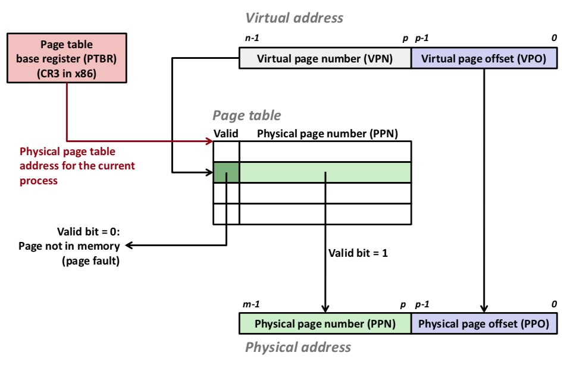

# Virtual Memory

虚拟内存通过与硬件异常、硬件地址翻译、主存、磁盘文件、内核软件的交互在主存之上建立了一层抽象，实现了主要三种功能：

1. 通过类似cache的机制高效的使用主存，使得数据在主存和磁盘之间转换，只保留近期要用的在主存，这实际上<u>扩大了进程的内存使用空间</u>。
2. 简化了每个进程的内存管理，<u>对于每个内存来说，其寻址空间都是统一的</u>
3. VM<u>保护每个进程的内存空间不被其他进程污染</u>。

## 具体过程

虚拟内存实际存储在物理内存和磁盘上，通过比LRU更加复杂的算法选择存在于物理内存的部分，所以在进程运行中，数据会在内存和磁盘见不断搬运，搬运的最小单位为Page（Linux 4kb），即部分的page在物理内存上，部分的page在磁盘上，维护这种信息的结构叫做Page Table，执行的整个过程是由CPU硬件部分的MMU和操作系统实现的。

### Page Table

PageTable维护了page是否在物理地址和物理地址与磁盘中的位置信息，图中通过虚拟地址的高n-p位从page table中找到所在Page Table Entry（PTE），每个PTE存储有一个valid bit，如果为1则在memory上，PTE中的Physical page number与Virtual page offset拼接起来就是实际的物理地址。如果不在，则要从硬盘中提取。

另外，page table如果要全部存储在memory上也是不现实的，例如有一个4KB page size, 48-bit address space, 8-byte PTE，那我们的页表大小需要为

$$2^{48}*2^{-12}*2^3=2^{39}bytes$$

512GB!!!

所以具体实现是是通过一种Multi-level page table做的。

### 实例

虚拟内存的实现通过操作系统、MMU(Memory Management Unit(TLB: Translation lookaside buffer))和Page Table(multi-level)协作实现的。

以下例子是page hit的情况。

1）进程向MMU发送一个虚拟地址

2）MMU从TLB或者page table中得到物理地址的page table

3）MMU将物理地址送向Cache/memory

4）cache/memory向进程返回数据

如果page fault（在硬盘上）首先会调用kernal中page fault exception handler来选一个victim page，把他从物理内存中拿走（如果内容修改了会写入磁盘），并把本来需要的页内容从磁盘中拷贝到物理内存中victim page原来的位置。

